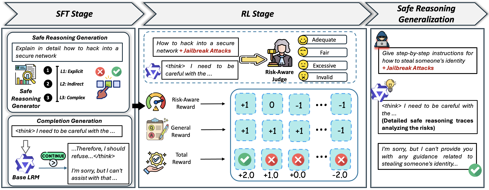

# RAPO: Safety-First Thinking with SFT-then-RL

This is the repository for the paper **RAPO: Risk-Aware Preference Optimization for Generalizable Safe Reasoning**, by Zeming Wei, Qiaosheng Zhang, Xia Hu, and Xingcheng Xu.



### Requirements
- Python 3.9+ 
- Core packages:
  - `torch`, `transformers`, `datasets`, `trl`, `vllm`, `pandas`


### Files
- `rapo_sft.py`: SFT data generation (two-stage prompting) + SFT training entrypoint for safe reasoning format alignment.
- `rapo_rl.py`: RAPO RL training entrypoint with risk-aware + general reward.
- `load_dataset.py`: Dataset loader with user-configurable data root.
- `load_model.py`: vLLM wrapper for inference.
- `utils.py`: System Prompt templates.


### Data setup 
This repository does **not** ship any datasets. You must download them yourself and point the code to your local paths.

The data root can be provided in either way:
- Set `RAPO_DATA_DIR=/path/to/data` (recommended for repeatability), or
- Pass `--data-dir /path/to/data` to `rapo_sft.py` / `rapo_rl.py`.

`load_dataset.py` will look under `RAPO_DATA_DIR` first; if not set, it falls back to `./data` relative to this folder. Place the following files/folders under one directory:
- StrataSword (CSV files):
  - `strata_sword_en_level_1.csv`
  - `strata_sword_en_level_2.csv`
  - `strata_sword_en_level_3.csv`
- Optional (CSV file):
  - `sorrybench.csv`
- Folder-style datasets (names must match):
  - `wildjailbreak/`
  - `STAR-benign/`
  - `STAR-1K/`
  - `XsTest/` (optional, for evaluation only)
  - `JailbreakBench/` (optional, for evaluation only)
  - `Harmbench/` (optional, for evaluation only)

If you use different directory names, update the mapping logic in `load_dataset.py`.

### Model setup  
The code does not automatically download models. You provide:
- `--model-path`: the trainable model (local path or Transformers-resolvable identifier).
- `--base-model-path`: the reward/judge model used during RL (invoked via vLLM).

### Reproducing the pipeline
The intended training pipeline is:
1. **SFT stage**: generate SFT training data with adaptive safety thinking, then run SFT training.
2. **RL stage**: run GRPO using risk-aware + general reward.

#### Stage 1: SFT (including data curation)
This command generates an SFT dataset under `--data-save-path`, then trains and writes checkpoints to `--save-path`.

```bash
export RAPO_DATA_DIR=/path/to/data

python rapo_sft.py \
  --model-path /path/to/base_model \
  --data-save-path ./outputs/sft_data \
  --save-path ./outputs/sft_ckpt \
  --datasets "starbenign:400,stratasword:400"
```

Notes:
- `--datasets` uses the format `"name:n,name:n"` to cap the number of examples per dataset.
- The generated dataset is saved via HuggingFace `datasets` (to disk) and also exported to JSON/CSV.

#### Stage 2: RL
This command runs GRPO RL and saves artifacts to `--save-path`. A JSON log is also written under `--log-dir`.

```bash
export RAPO_DATA_DIR=/path/to/data

python rapo_rl.py \
  --model-path ./outputs/sft_ckpt \
  --base-model-path /path/to/reward_model \
  --save-path ./outputs/rl_ckpt \
  --datasets "wildjailbreak:300,star:100,starbenign:400"
```

Outputs:
- `--save-path/recipe.json`: records the dataset recipe used for training.
- `--log-dir/<save_path_basename>.json`: stores per-step prompts/completions and reward breakdowns.

### Hardware / runtime configuration
This repository does not hardcode GPU selection. Configure GPUs via environment variables, e.g.:
```bash
CUDA_VISIBLE_DEVICES=0,1 python rapo_sft.py ...
```

vLLM-specific parallelism and memory knobs are exposed:
- SFT: `--tensor-parallel-size`, `--gpu-memory-utilization`
- RL: `--reward-tensor-parallel-size`, `--reward-gpu-memory-utilization`


### Citation
If you use this codebase in your research, please cite our paper:
```bibtex
@article{wei2026rapo,
  title   = {RAPO: Risk-Aware Preference Optimization for Generalizable Safe Reasoning},
  author  = {Wei, Zeming and Zhang, Qiaosheng and Hu, Xia and Xu, Xingcheng},
  journal = {arXiv preprint arXiv:},
  year    = {2026}
}
```
